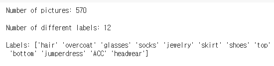
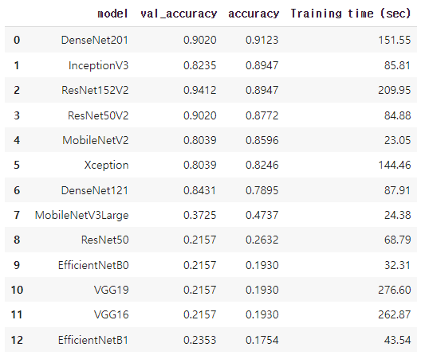
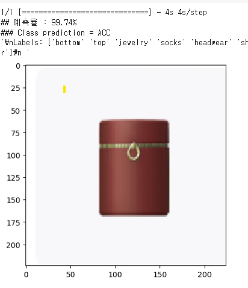
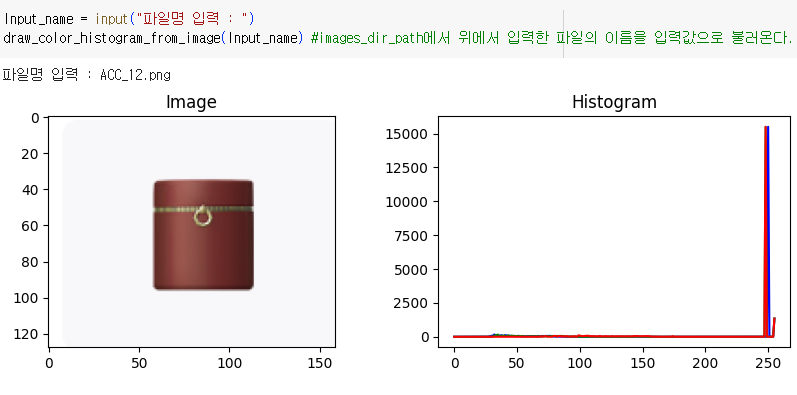
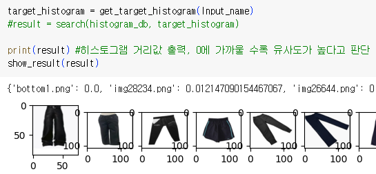

# research1
[개별연구1] 메타버스 내에서 발생하는 다양한 범죄 예방 

# 제페토 아이템 디자인 및 지식재산권 침해 예방 연구

## 개요
- 메타버스 플랫폼 **제페토**에서 **300만**명의 사용자가 아이템을 제작하고 판매.
- 디자인 과정에서 **지식재산권 침해** 가능성 존재, 특히 에르메스 사례에서 확인됨.
- 본 연구는 사용자가 제작한 아이템의 디자인이 지식재산권을 침해하지 않도록 예방하는 방법을 제시.

## 연구 목적
- 사용자가 제작한 아이템의 디자인과 특허청 등록 디자인 이미지 간 유사도 분석.
- 유사한 디자인을 사용자에게 출력하여 스스로 침해 여부 판단 가능하게 함.

## 방법론
### 1. 딥러닝 기반 카테고리 분류
- **데이터셋**: 제페토 스튜디오의 기본 디자인 이미지(167개).
- 데이터 증강: 좌우 반전, 기울이기, 노이즈 추가 등을 통해 **570개**로 증가.

- 모델: **Conv2D, MaxPool2D, Flatten**, **DenseNet201** 등 총 13개 모델 실험.

- 결과: **DenseNet201** 모델이 **91.23%** 정확도로 카테고리 분류.

### 2. OpenCV를 활용한 이미지 유사도 분석
- **데이터셋**: 특허청 등록 디자인 이미지 약 **14,000개** (각 카테고리 평균 1,100개).
- 유사도 분석: OpenCV의 `compareHist` 함수를 사용하여 색상(RGB) 히스토그램 추출 및 비교.
- 효율성: 해당 카테고리 이미지와만 비교하여 검사 프로세스 최적화.

## 기대 효과
- 사용자가 제작한 아이템의 디자인에 대한 **자체 판단** 가능.
- 지식재산권 침해 가능성을 **사전 예방**하는 시스템 구축.

## 결론
본 연구는 딥러닝과 이미지 유사도 분석을 통해 제페토 사용자들이 제작한 아이템의 디자인이 지식재산권을 침해하지 않도록 돕는 길잡이가 될 것으로 기대됨.
